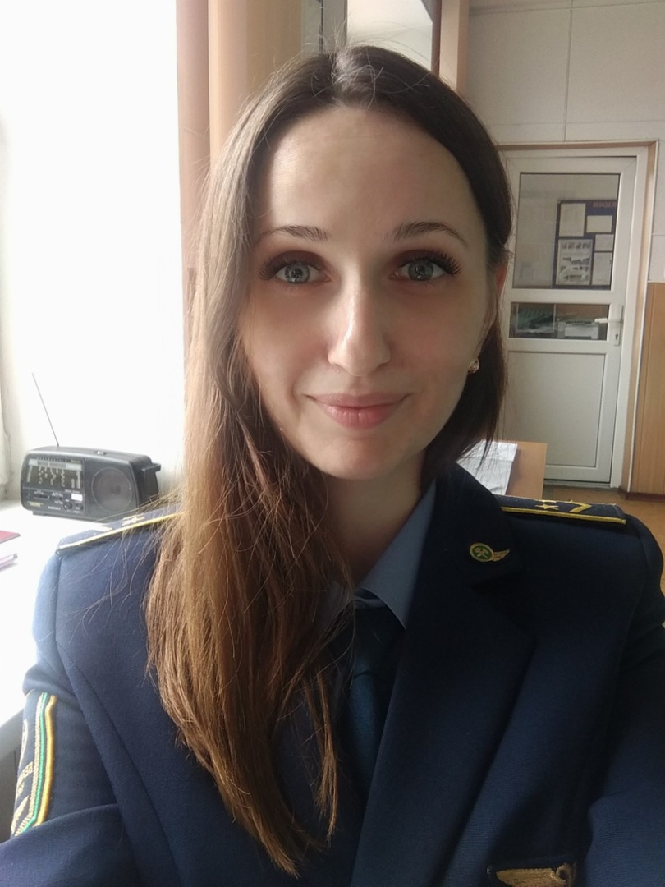

<html>
 <head>
  <meta http-equiv="Content-Type" content="text/html; charset=utf-8">
  <title>cv</title>
 </head>
 <body>
   

   

  <strong> Personal Information: </strong> 
  <!-- Персональные данные -->

  <ul>
    <li>First name: Ilona;</li>
    <li>Last name: Fasolia;</li>
    <li>Nationality: Belarus;</li>
    <li>Location: Minsk, Belarus;</li>
    <li>Marital status: single;</li>
    <li>Date of birth: 6th October 1986;</li>
    <li>Email: Ilona_b9ka@mail.ru;</li>
  </ul>

  <strong>Summary:</strong>
  <!-- Цель -->
Start a career as a Junior Frontend Developer in company and after 5 years grow to a Senior .

  <strong>Skills:</strong>
   <!-- Скилы -->
  <ul>
    <li>Knowledge of HTML, CSS, JavaScript, jQuery, Vue.js, Nuxt.js, Docker, Git, Figma, VS code;</li>
    <li>Ability to work in a team;</li>
    <li>Strong communication skills;</li>
  </ul>

<strong>Experience:</strong>
 <!-- Опыт -->
<a href="https://github.com/Biven160690/Dreamcar.git">project</a>

<strong>Education:</strong>
 <!-- Образование -->
  <ul>
    <li>2004-2009 Belarusian State University of Transport</li>
    <li>2021 IBA Institute courses "Programming on JavaScript"</li>
  </ul>

</body>
 
</html>
